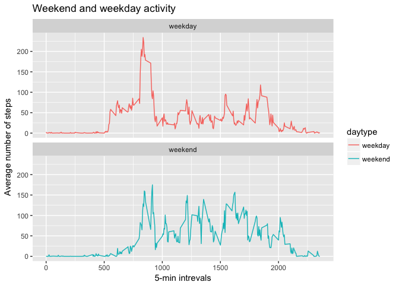

# Reproducible Research: Peer Assessment 1


## Loading and preprocessing the data


```r
activity<-read.csv("activity.csv")
summary(activity)
```

```
##      steps                date          interval     
##  Min.   :  0.00   2012-10-01:  288   Min.   :   0.0  
##  1st Qu.:  0.00   2012-10-02:  288   1st Qu.: 588.8  
##  Median :  0.00   2012-10-03:  288   Median :1177.5  
##  Mean   : 37.38   2012-10-04:  288   Mean   :1177.5  
##  3rd Qu.: 12.00   2012-10-05:  288   3rd Qu.:1766.2  
##  Max.   :806.00   2012-10-06:  288   Max.   :2355.0  
##  NA's   :2304     (Other)   :15840
```
Using the commands "summary(activity)" and View(activity) we see that the data has 3 columns (steps(numeric), date(factor), interval(numeric)). The column "steps" has 2304 NA's. 

```r
activity$day <- weekdays(as.Date(activity$date))
```

## What is mean total number of steps taken per day?

```r
activity_sum<-aggregate(activity$steps, list(activity$date), FUN=sum,na.rm=TRUE)
colnames(activity_sum)<-c("date","stepssum")
hist(activity_sum$stepssum, breaks=10,col="salmon",xlab = "Total Number of steps", main="Total Number of steps")
```

<!-- -->

###The average and median of the number of steps taken per day:


```r
mean(activity_sum$stepssum)
```

```
## [1] 9354.23
```

```r
median(activity_sum$stepssum)
```

```
## [1] 10395
```


## What is the average daily activity pattern?
Here we average the number of steps taken per interval regardless of the day.


```r
activity_mean<-aggregate(activity$steps~activity$interval, FUN=mean,na.rm=TRUE)
colnames(activity_mean)<-c("interval","stepsmean")
plot(activity_mean$interval,activity_mean$stepsmean, type="l",col="salmon",xlab = "Five minute intervals", ylab="Number of steps (average)", main="Average number of steps per Interval")
```

<!-- -->

### Which 5 minute interval has the highest number of steps?
Indentify which row has maximum steps per interval and identify the interval


```r
activity_mean[which.max(activity_mean$stepsmean),]$interval
```

```
## [1] 835
```


## Imputing missing values

We have seen above in the summary(activity) (our original data) that there are 2304 NA's in the column "steps". The NA values in this column can be replaced (imputed) in various ways. Here we replace the NA's with the average number of steps taken per each 5 minute interval. We match the two interval columns, creating a correspondence between (for example) inteval 0 of average number of steps interval 0's in our activity data that may or may not include an NA.  

```r
steps_match<-activity_mean$stepsmean[match(activity_mean$interval,activity$interval)]
```

Create a vector corresponding to the steps colum of the activity data with the NA values replaced by averages of steps per interval:


```r
activity_noNA<-transform(activity,steps=ifelse(is.na(activity), yes=steps_match, no=activity$steps))
```

In this dataset the NA values are replaced by average number of steps per each interval. The remaining values are the number of steps taken per interval. We perform the same analysis as we did initially (ignoring the NA's) and check the histogram of the frequency of sum of the steps per interval. 


```r
activity_noNA_sum<-aggregate(activity_noNA$steps, list(activity_noNA$date), FUN=sum,na.rm=TRUE)
colnames(activity_noNA_sum)<-c("date","stepssum")
hist(activity_noNA_sum$stepssum, breaks=10,col="salmon",xlab = "Total Number of steps(imputed)", main="Total steps frequency (imputed)")
```

<!-- -->

Calculating the mean and median of the imputed steps per each five minute interval changes the mean and median to equals.  


```r
mean(activity_noNA_sum$steps)
```

```
## [1] 10766.19
```

```r
median(activity_noNA_sum$steps)
```

```
## [1] 10766.19
```

## Are there differences in activity patterns between weekdays and weekends?

The activity data set includes the days of the week as factor variables. To see the difference between weekday and weekend activity we will need to create a new factor variable by merging all the week days to the "weekday" variable and Saturday/Sunday to a "weekend" variable. 


```r
activity_noNA$daytype <- ifelse(activity_noNA$day %in% c("Saturday", "Sunday"), "weekend", "weekday")
```

To see the difference between weekend and weekday activity, we use the ggplot2 package.


```r
activity_daytype <- aggregate(steps~interval + daytype, activity_noNA, FUN=mean)

library(ggplot2)

plot<- ggplot(activity_daytype, aes(x=interval, y=steps, color=daytype))+ geom_line() +labs(title="Weekend and weekday activity", x="5-min intrevals", y="Average number of steps")+facet_wrap(~daytype, ncol=1, nrow=2)
print(plot)
```

<!-- -->

There is a difference in activity mostly in the mid-range intervals (presumably day time). Actvity during the weekend is more even than that during the weekday where there is a spike in activity around 800th interval. Note that I used the imputed data set rather than the original dataset with NA's. 
